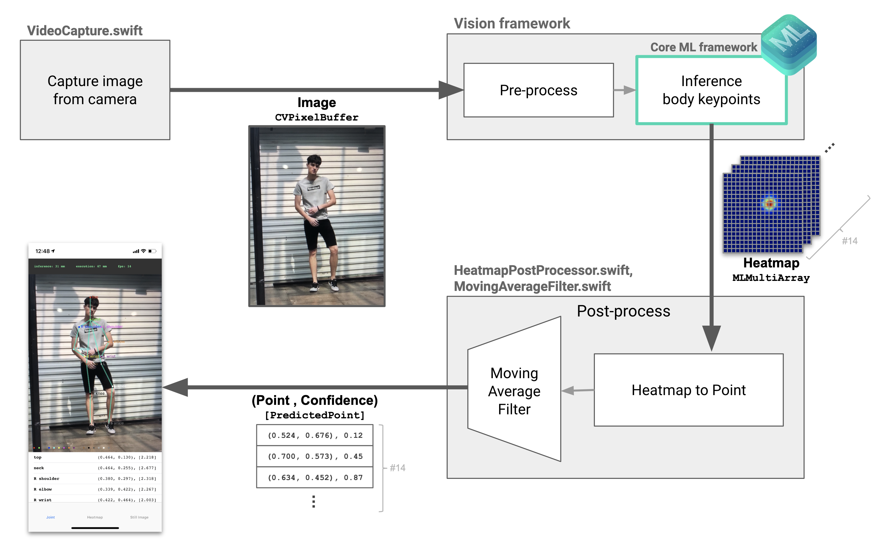

# PoseEstimation-CoreML

This project is Pose Estimation on iOS with Core ML. If you are interested in iOS + Machine Learning, visit [here](https://github.com/motlabs/iOS-Proejcts-with-ML-Models) you can see various DEMOs. 

| Jointed Keypoints                                            | Concatenated heatmap                                         |
| ------------------------------------------------------------ | ------------------------------------------------------------ |
|  |  |

[한국어 README](https://github.com/tucan9389/PoseEstimation-CoreML/blob/master/README_kr.md)

## How it works

Video source: [https://www.youtube.com/watch?v=EM16LBKBEgI](https://www.youtube.com/watch?v=EM16LBKBEgI)

## Requirements

- Xcode 9.2+
- iOS 11.0+
- Swift 4.1

## Download model

Pose Estimation model for Core ML(`model_cpm.mlmodel`) 
☞ Download Core ML model [model_cpm.mlmodel](https://github.com/edvardHua/PoseEstimationForMobile/tree/master/release/cpm_model) or [hourglass.mlmodel](https://github.com/edvardHua/PoseEstimationForMobile/tree/master/release/hourglass_model).

> input_name_shape_dict = {"image:0":[1,224,224,3]} image_input_names=["image:0"]  output_feature_names = ['Convolutional_Pose_Machine/stage_5_out:0']
>
> －in [https://github.com/edvardHua/PoseEstimationForMobile](https://github.com/edvardHua/PoseEstimationForMobile)

|                            | cpm                                      | hourglass          |
| -------------------------- | ---------------------------------------- | ------------------ |
| Input shape                | `[1, 192, 192, 3]`                       | `[1, 192, 192, 3]` |
| Output shape               | `[1, 96, 96, 14]`                        | `[1, 48, 48, 14]`  |
| Input node name            | `image`                                  | `image`            |
| Output node name           | `Convolutional_Pose_Machine/stage_5_out` | `hourglass_out_3`  |
| Inference time on iPhone X | 57 mm                                    | 33 mm              |

## Build & Run

### 1. Prerequisites

#### 1.1 Import pose estimation model

Once you import the model, compiler generates model helper class on build path automatically. You can access the model through model helper class by creating an instance, not through build path.

#### 1.2 Add permission in info.plist for device's camera access

### 2. Dependencies

No external library yet.

### 3. Code

(Ready to publish)

## See also

- [motlabs/iOS-Proejcts-with-ML-Models](https://github.com/motlabs/iOS-Proejcts-with-ML-Models) 
  : The challenge using machine learning model created from tensorflow on iOS
- [edvardHua/PoseEstimationForMobile](https://github.com/edvardHua/PoseEstimationForMobile) 
  : TensorFlow project for pose estimation for mobile

